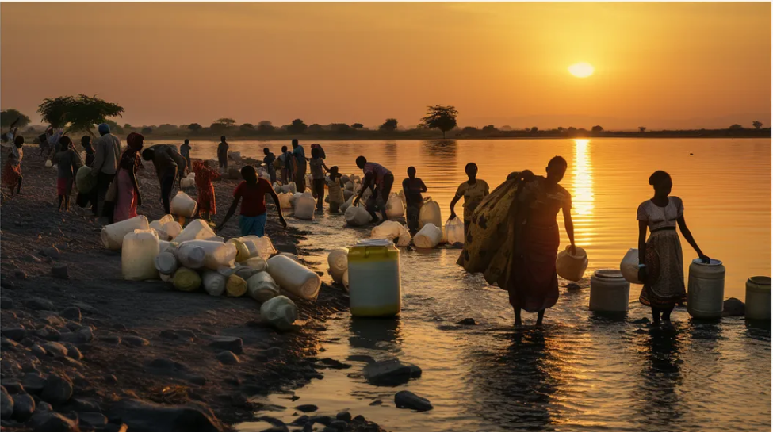

# SQL DATA QUERYING: PART 1
## Maji Ndogo: From analysis to action
 **Beginning Our Data-Driven Journey in Maji Ndogo**

***
 
***
**Author**: 
* [Kelvin SIla](https://github.com/ksila01)
***
### Project Overview
This project is dedicated to analyzing survey data related to water access and quality in Maji Ndogo. Using SQL queries, we aim to transform extensive survey records into actionable insights. The analysis will cover various aspects such as water source types, visit patterns, water quality, and pollution issues. The ultimate goal is to identify key insights that will contribute to improving water access and quality in the community.
***

* Explore the foundational tables and their structures:

**Tables Available**
* data_dictionary * employee * global_water_access * location *visits * water_quality * water_source * well_pollution
***
### Understanding Water Sources

